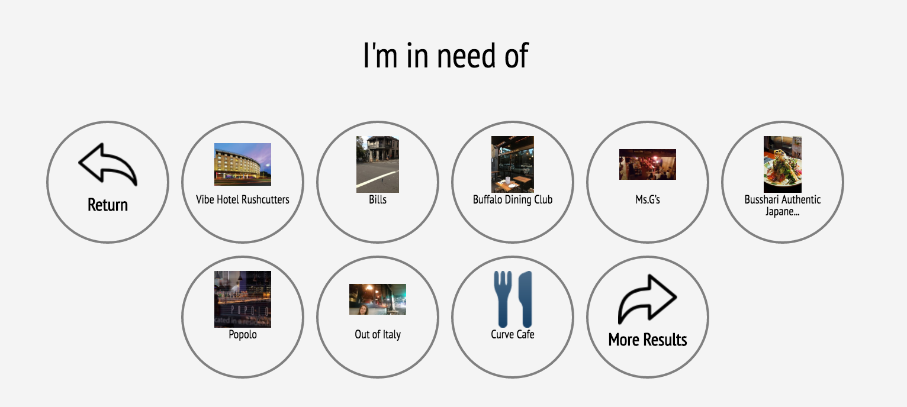

# Location-Finder-For-GM-Vehicles

Lets you find restaurants, hotels, atms and gas nearby within a set distance. (At present 500m but looking for developers to build slider)

# How to Run

1. Pull Repo From github
2. In directory, run command

npm install -g ./ngi-sdk.tar

note: You need to be running Node 4.7

3. cd website
4. run ngi serve
5. Have fun.

# About the Project

The webapp, takes gps coordinates from GM's ngi vehicle api and then uses these coordinates with the google places api to find places
within a set distance. 

# Screen Shots

